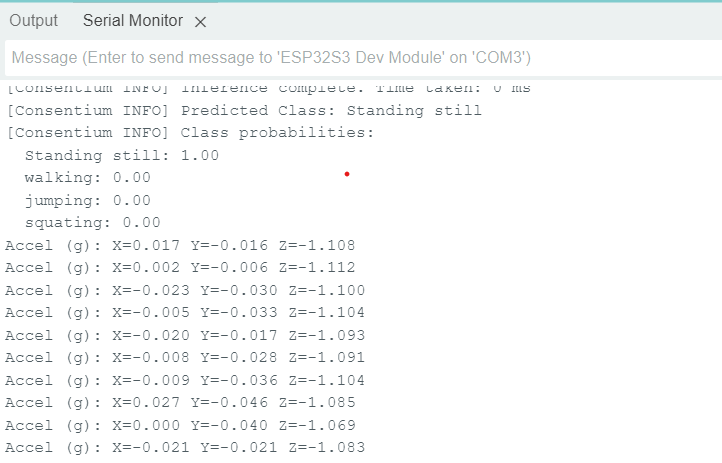
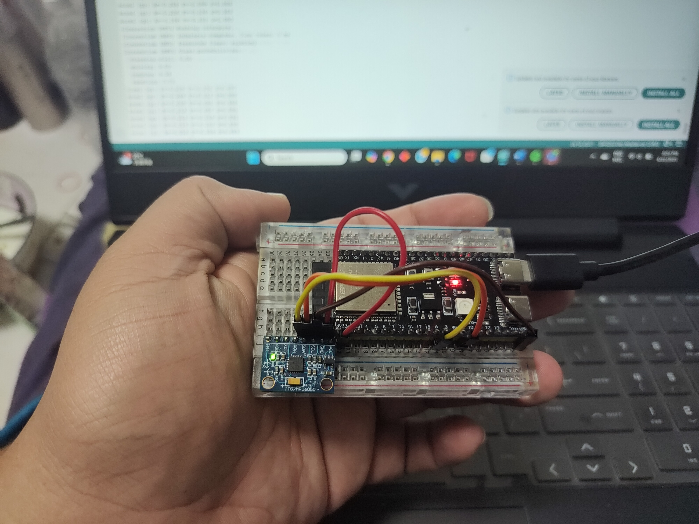

# 🤖 Human Activity Recognition using MPU6050 & EdgeNeuron (Arduino C++)

This project demonstrates real-time human activity recognition on a microcontroller using the **MPU6050** IMU sensor and a **TensorFlow Lite** model deployed through **EdgeNeuron**. The model recognizes four activities:

- 🚶 Walking  
- 🧍 Standing Still  
- 🤸 Jumping  
- 🏋️ Squatting  

## 📦 Project Structure

## ⚙️ Hardware Used
- Arduino-compatible board (e.g. ESP32, Nano, etc.)
- MPU6050 Accelerometer & Gyroscope
- Optional: Serial monitor for real-time activity output

## 🧠 Machine Learning
The machine learning model is trained using the dataset from [Kaggle's Human Activity Recognition Dataset](https://www.kaggle.com/datasets/igorgabriel1/har-dataset-laica-laboratory). The model input consists of **10 timesteps × 3-axis acceleration values**, and the output is a 4-class prediction.

### Input Shape:

### Output Classes:
- `0`: Standing Still
- `1`: Walking
- `2`: Jumping
- `3`: Squatting

> ⚠️ The model file is **not uploaded** here. If you're interested, please train your own or use tools like [Edge Impulse](https://edgeimpulse.com) or [Teachable Machine](https://teachablemachine.withgoogle.com/).

## 🔧 How to Use
1. Clone this repo
2. Open `src/main.ino` in Arduino IDE
3. Upload to your board
4. Open Serial Monitor (baud rate: 115200)
5. Move with one of the 4 activity patterns – the system will detect and print the label

## 📝 Data & License
The dataset used for training the model is from [Kaggle: Human Activity Recognition Dataset](https://www.kaggle.com/datasets/igorgabriel1/har-dataset-laica-laboratory). The data license was not specified, so it is **used only for educational and non-commercial purposes**.

If you're the original dataset owner and wish to request removal, please [open an issue](https://github.com/YOUR_USERNAME/YOUR_REPO/issues).

---

## 👨‍💻 About Me
This project is part of my exploration in:
- Embedded Machine Learning (TinyML)
- Real-time activity recognition
- C++ programming with Arduino

Feel free to explore, fork, or reach out!  
🧠 Built with help from ChatGPT and open-source tools.

## 🖼️ Activity Prediction

Below is an example of the prediction results shown in the Serial Monitor:

## 🖼️ Board Image

Below is the image of the board:

